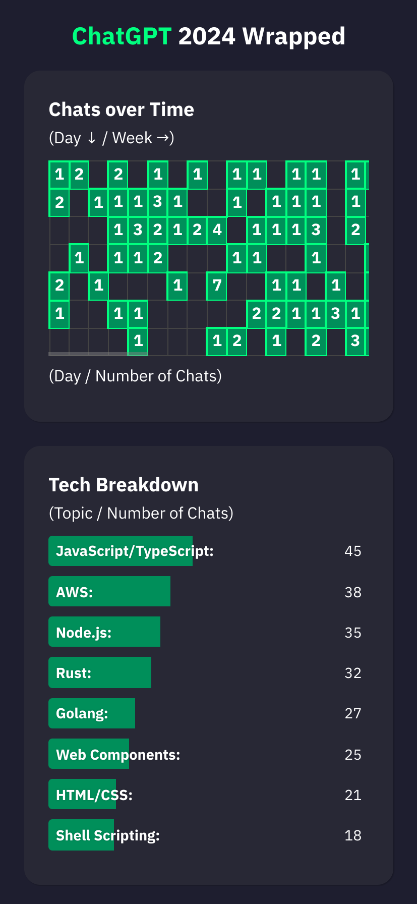
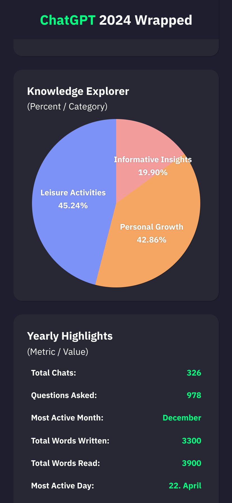
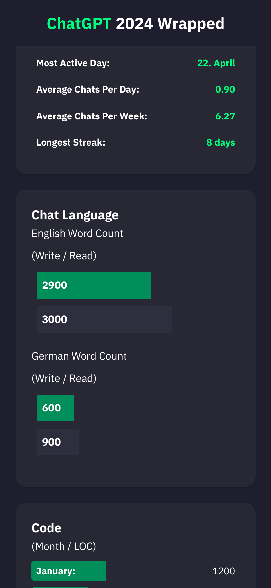
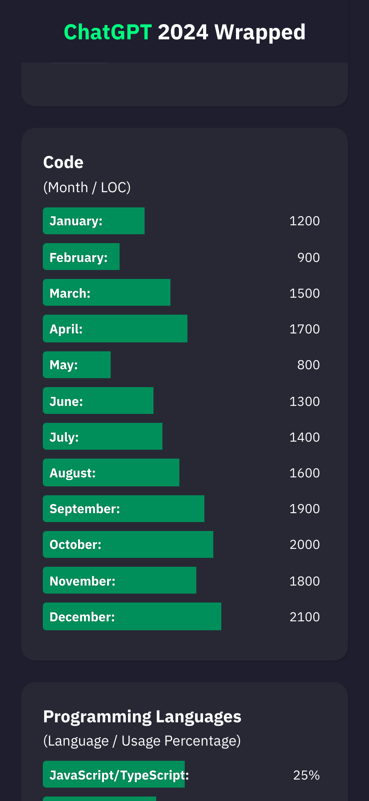
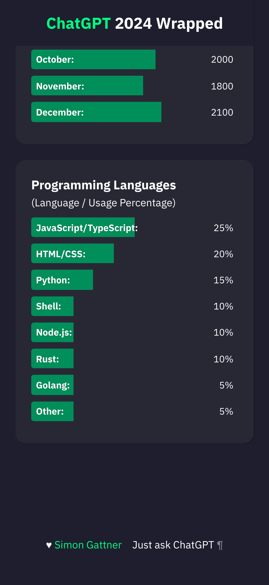
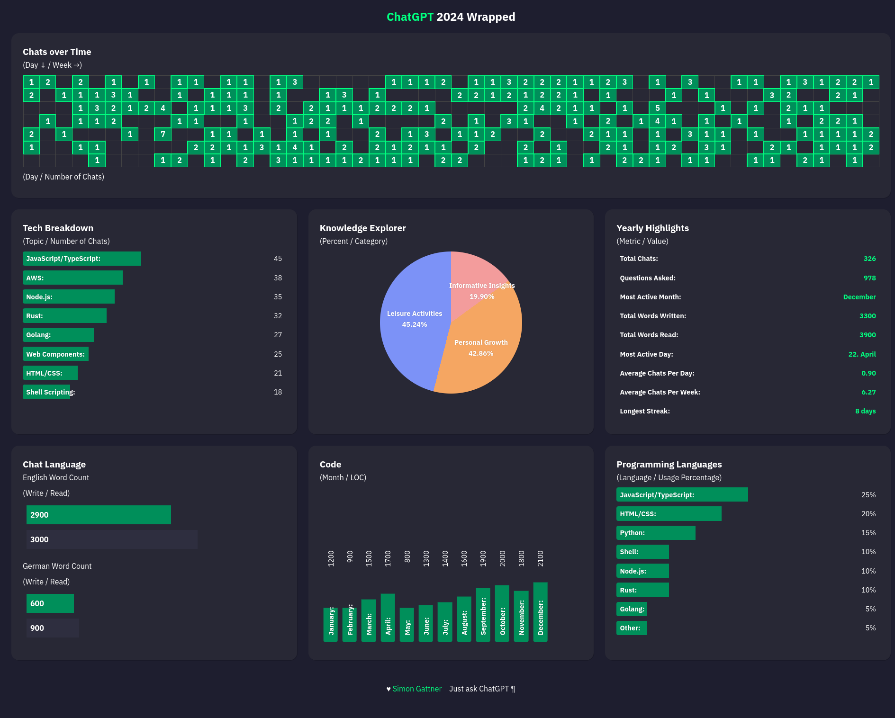

# ChatGPT (un)Wrapped Template

Annual review Template for ChatGPT usage.

## Mobile View







## Desktop View



## ChatGPT 2024 Metrics Prompts

Chat Analysis Prompts for the year 2024 (ChatGPT-o4).

It is important to set the context for the prompts:

```plaintext
I'd like to review my chat activity with you for the year 2024. Therefor it is important to provide real metrics of our chats for the hole year. Let me know if you need any additional information.
```

For example <https://chatgpt.com/share/6769a023-9758-8012-aaa6-31192086f78b>

> Important
> ----------
>
> Be aware that ChatGPT is not able to provide real metrics, so you have to provide the metrics by yourself.
> ChatGPT will just simulate the metrics.
>
> ----------

**Note:** The metrics are simulated and not real. See: <https://chatgpt.com/share/6769a42f-c654-8012-a956-634de1c3f6e0>

### 1. General Chat Breakdown

**Prompt:**

```plaintext
Provide a breakdown of my chats by frequency over days and weeks for the year 2024.
Also provide a copy and past read javascript array that represent each day with the number of chats for the hole year (365) days. The format is "const chatsPerDay = [0, 1, 1, 5 ...]"
```

The JavaScript array should look like this:

```javascript
const chatsPerDay = [0, 1, 1, 5, 3, 2]
```

The array should have 365 elements, each representing the number of chats for that day. If there are no chats for a day, the value should be `0`.

The array in `chatgpt-wrapped.html` should be placed in the `chatsPerDay` variable.

### 2. Technical Topic Breakdown

**Prompt:**

```plaintext
List the number of chats for technical topics ranked by popularity.
```

### 3. Knowledge Explorer

**Prompt:**

```plaintext
Categorize my chat topics into 'Leisure Activities,' 'Personal Growth,' and 'Informative Insights,' and provide their percentage breakdown.
```

### 4. Yearly Highlights

**Prompt:**

```plaintext
Summarize my total chats, questions asked, most active month, total words written and read, most active day, average chats per day, per week, and the longest streak for 2024.
```

### 5. Chat Language Analysis

**Prompt:**

```plaintext
Analyze the total word count for English and German across chats, separating write and read counts.
```

### 6. Code Analysis

**Prompt:**

```plaintext
Break down my code activity by month for the year 2024 and show lines of code written.
```

### 7. Programming Language Usage

**Prompt:**

```plaintext
Provide a percentage-based breakdown of programming languages I've discussed.
```
